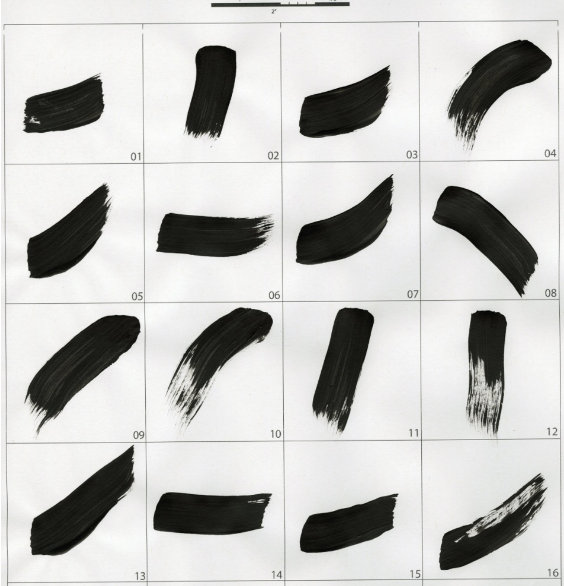
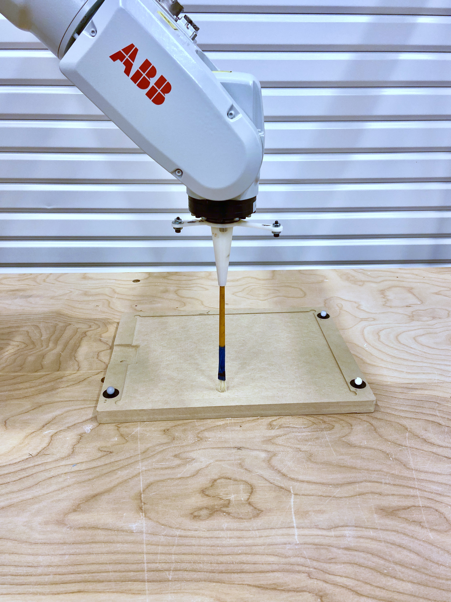

# Artistic Style Robotic Painting

by: Ardavan Bidgoli, Manuel Rodriguez Ladrón de  Guevara, Cinnie Hsiung, Jean Oh, Eunsu Kang
A research project on applying artistic style for robotic painting.

<p align="center">
  <a href= "https://www.youtube.com/watch?v=UUFIJr9iQuA">
    
  </a>
</p>

The project is under development in two branches:

1. Applying Artistic Style
   - [x] Playback: Colelcting user's brushstrokes and reproduce them on a robot.
   - [ ] Generation: Generating new brushstrokes based on the collected data:
      - [x] Bitmap representation of brushstrokes
      - [ ] Sequence of motions to reproduce the physical brushstroke
2. Painting using a robotic arm:
    - [x] Painting abstract images using robotic plain brushstrokes

* The ultimate goal is to combine the two branches:
  - [ ] Robotic painting using stylized brushstrokes.
  
--------------------------------------------------------------
## Publication

(will be added later)

## Installation
Use [Anaconda](https://docs.conda.io/en/latest/miniconda.html) to manage the environment. (optional, but hughly recommended)
```bash
conda create -n python37 python=3.7
source activate python37
git clone https://github.com/Ardibid/ArtisticStyleRoboticPainting.git
cd ArtisticStyleRoboticPainting
```

Install dependencies by running this script:
```bash
 pip3 install -r requirements.txt
```
or 
```bash
 python -m pip install -r requirements.txt
```

## Structure

The repo is organized in two sectoins: 1) data set, 2) ML models, 3) robotic control process.

### The data set:

The data set contains +700 examples of brushstrokes demonstrated by a user. Each brushstroke is availabel as a pair, 1) the sequence of brush motions in space, 2) the scanned brushstoke as an image.
<!--  -->
<p align="center">    </p>

**Brush motions** were collected using a motion capture system and a costum-made rigid-body marker. The coordinations were processed later, thus the center of coordination system is located at the center of each cell. Brushmotions are saved as numpy array.

**Brtushstrokes** are scanned and converted to fixed size images and saved as a numpy array.
<!--  -->
<p align="center">    </p>

# Tests

## Robotic setup

We use an ABB IRB 120 articulated robotic arm with 6 degree of freedom. The inverse kinematics as well as controlling the torque on each joint is moderated by the ABB drivers. We feed the robot with a sequence of target poses.
<!--   -->
<!-- <p align="center">  </p> -->
<p align="center">  </p>

## Generating new samples

We used a VAE to generate new samples of brushstrokes.
<!--  -->
<p align="center">  </p>
