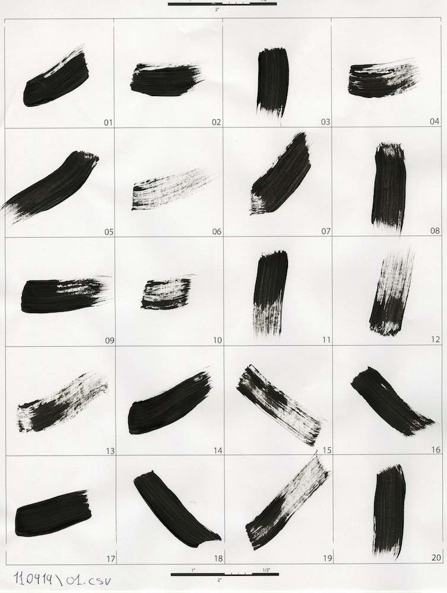
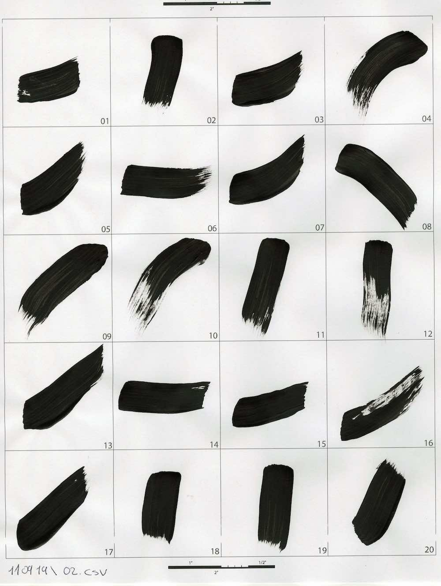

# Artistic Style Robotic Painting

by: [Ardavan Bidgoli](ardavan.io), Manuel Rodriguez Ladrón de  Guevara, Cinnie Hsiung, @jeanoh, Eunsu Kang
A research project on applying artistic style for robotic painting.

<p align="center">
  <a href= "https://www.youtube.com/watch?v=UUFIJr9iQuA">
    
  </a>
</p>

The project is under development in two branches:

1. Applying Artistic Style
   - [x] Playback: Colelcting user's brushstrokes and reproduce them on a robot.
   - [ ] Generation: Generating new brushstrokes based on the collected data:
      - [x] Bitmap representation of brushstrokes
      - [ ] Sequence of motions to reproduce the physical brushstroke
2. Painting using a robotic arm:
    - [x] Painting abstract images using robotic plain brushstrokes

- The ultimate goal is to combine the two branches:
  - [ ] Robotic painting using stylized brushstrokes.
  
--------------------------------------------------------------
# Publication
**Artistic Style in Robotic Painting: a Machine Learning Approach to Learning Brushstroke from Human Artists**
[[arXiv](https://arxiv.org/abs/2007.03647)]

Robotic painting has been a subject of interest among both artists and roboticists since the 1970s. Researchers and interdisciplinary artists have employed various painting techniques and human-robot collaboration models to create visual mediums on canvas. One of the challenges of robotic painting is to apply a desired artistic style to the painting. Style transfer techniques with machine learning models have helped us address this challenge with the visual style of a specific painting. However, other manual elements of style, i.e., painting techniques and brushstrokes of an artist have not been fully addressed. We propose a method to integrate an artistic style to the brushstrokes and the painting process through collaboration with a human artist. In this paper, we describe our approach to 1) collect brushstrokes and hand-brush motion samples from an artist, and 2) train a generative model to generate brushstrokes that pertains to the artist's style, and 3) integrate the learned model on a robot arm to paint on a canvas. In a preliminary study, 71% of human evaluators find our robot's paintings pertaining to the characteristics of the artist's style.
### Citation
If you find our paper and dataset useful in your research, please consider citing:
``` 
@misc{bidgoli2020artistic,
    title={Artistic Style in Robotic Painting; a Machine Learning Approach to Learning Brushstroke from Human Artists},
    author={Ardavan Bidgoli and Manuel Ladron De Guevara and Cinnie Hsiung and Jean Oh and Eunsu Kang},
    year={2020},
    eprint={2007.03647},
    archivePrefix={arXiv},
    primaryClass={cs.RO}
}
```

# Installation
Use [Anaconda](https://docs.conda.io/en/latest/miniconda.html) to manage the environment. (optional, but highly recommended)

```bash
conda create -n python37 python=3.7
source activate python37
git clone https://github.com/Ardibid/ArtisticStyleRoboticPainting.git
cd ArtisticStyleRoboticPainting
```

### Dependencies
* Python 3.7
* [Tensorflow](https://www.tensorflow.org/) 2.2.0
* Numpy 1.18.2
* Sklearn 0.22.2
* Scipy 1.4.1

Install dependencies by running this script:

```bash
 pip3 install -r requirements.txt
```

or

```bash
 python -m pip install -r requirements.txt
```

--------------------------------------------------------------

## Structure

The repo is organized in two sectoins: 1) data set, 2) ML models, 3) robotic control process.

### The data set

The data set contains +700 examples of brushstrokes demonstrated by a user. Each brushstroke is availabel as a pair, 1) the sequence of brush motions in space, 2) the scanned brushstoke as an image. Use [this notebook](./Notebooks/Motion_and_image_processing_visualizations.ipynb) to process and review data.
<!--  -->

**Brush motions** were collected using a motion capture system and a costum-made rigid-body marker. The coordinations were processed later, thus the center of coordination system is located at the center of each cell. Brushmotions are saved as numpy array.
<div  align="center">   
  
   
   
  <p style="font-size:12px"> The tracker rigidbody (left), the brush with tracker installed and paperholder rigidbody (center), recording samples by motion capture (right). </p>
</div>

<div  align="center">   
  
  <p style="font-size:12px"> Manual data collection process. </p>
</div>

**Brtushstrokes** are scanned and converted to fixed size images and saved as a numpy array.

<div  align="center">   
  
  
  
  
  <p style="font-size:12px"> Scanned brushstrokes. </p>
</div>

-------
# Tests
[WIP]
## Robotic setup

We use an ABB IRB 120 articulated robotic arm with 6 degree of freedom. The inverse kinematics as well as controlling the torque on each joint is moderated by the ABB drivers. We feed the robot with a sequence of target poses.
<!--   -->
<!-- <p align="center">  </p> -->
<p align="center">  </p>

## Generating new samples

We used a VAE to generate new samples of brushstrokes.
<!--  -->
<p align="center">  </p>
