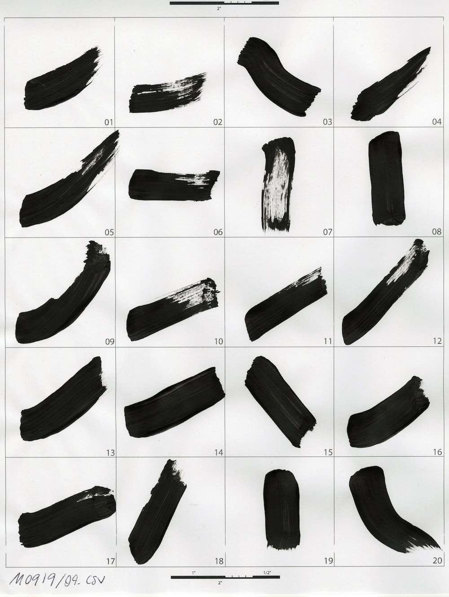

# Artistic Style Robotic Painting

by: [Ardavan Bidgoli](ardavan.io), [Manuel Rodriguez Ladrón de  Guevara](https://github.com/manuelladron) , [Cinnie Hsiung](https://github.com/cinniehsiung?tab=overview&from=2017-01-01&to=2017-01-31), [Jean Oh](https://github.com/jeanoh) , [Eunsu Kang](https://github.com/kangeunsu)

#### [arXiv](https://arxiv.org/abs/2007.03647) | [YouTube](https://www.youtube.com/watch?v=UUFIJr9iQuA)

**Artistic Style in Robotic Painting: a Machine Learning Approach to Learning Brushstroke from Human Artists**


Robotic painting has been a subject of interest among both artists and roboticists since the 1970s. Researchers and interdisciplinary artists have employed various painting techniques and human-robot collaboration models to create visual mediums on canvas. One of the challenges of robotic painting is to apply a desired artistic style to the painting. Style transfer techniques with machine learning models have helped us address this challenge with the visual style of a specific painting. However, other manual elements of style, i.e., painting techniques and brushstrokes of an artist have not been fully addressed. We propose a method to integrate an artistic style to the brushstrokes and the painting process through collaboration with a human artist. In this paper, we describe our approach to 1) collect brushstrokes and hand-brush motion samples from an artist, and 2) train a generative model to generate brushstrokes that pertains to the artist's style, and 3) integrate the learned model on a robot arm to paint on a canvas. In a preliminary study, 71% of human evaluators find our robot's paintings pertaining to the characteristics of the artist's style.

This project aims to develop a method to integrate an artistic style to the brushstrokes and the painting process through collaboration with a human artist. In this paper, we describe our approach to 1) collect brushstrokes and hand-brush motion samples from an artist, and 2) train a generative model to generate brushstrokes that pertains to the artist's style, and 3) integrate the learned model on a robot arm to paint on a canvas.

**Table of Contents**

- [Status](#Status)
- [Installation](#installation)
  - [Dependencies](#Dependencies)
- [Dataset](#Dataset)
- [Test](#Test)
- [Acknowledgments](#Acknowledgments)
- [Citation](#Citation)


## Status

The project is under development in two branches:

1. Applying Artistic Style
   - [x] Playback: Colelcting user's brushstrokes and reproduce them on a robot.
   - [ ] Generation: Generating new brushstrokes based on the collected data:
      - [x] Bitmap representation of brushstrokes
      - [ ] Sequence of motions to reproduce the physical brushstroke
2. Painting using a robotic arm:
    - [x] Painting abstract images using robotic plain brushstrokes

- The ultimate goal is to combine the two branches:
  - [ ] Robotic painting using stylized brushstrokes.
  


# Installation

Use [Anaconda](https://docs.conda.io/en/latest/miniconda.html) to manage the environment. (optional, but highly recommended)

```bash
conda create -n python37 python=3.7
source activate python37
git clone https://github.com/Ardibid/ArtisticStyleRoboticPainting.git
cd ArtisticStyleRoboticPainting
```

### Dependencies

- Python 3.7
- [Tensorflow](https://www.tensorflow.org/) 2.2.0
- Numpy 1.18.2
- Sklearn 0.22.2
- Scipy 1.4.1

Install dependencies by running this script:

```bash
 pip3 install -r requirements.txt
```

or

```bash
 python -m pip install -r requirements.txt
```


# Dataset

The dataset contains +700 examples of brushstrokes demonstrated by a user. Each brushstroke is availabel as a pair, 1) the sequence of brush motions in space, 2) the scanned brushstoke as an image. Use [this notebook](./Notebooks/Motion_and_image_processing_visualizations.ipynb) to process and review data.
<!--  -->

**Brush motions** were collected using a motion capture system and a costum-made rigid-body marker. The coordinations were processed later, thus the center of coordination system is located at the center of each cell. Brushmotions are saved as numpy array.
<div  align="center">   
  <!--  -->
  
   
  <p style="font-size:12px"> The tracker rigidbody (left), the brush with tracker installed and paperholder rigidbody (center), recording samples by motion capture (right). </p>
</div>

<div  align="center">   
  
     

  <p style="font-size:12px"> Manual data collection process. </p>
</div>

**Brtushstrokes** are scanned and converted to fixed size images and saved as a numpy array.

<div  align="center">   
  
  
  
  
  <p style="font-size:12px"> Scanned brushstrokes. </p>
</div>


# Tests

We set up a series of tests to investigate our approach:

**Robotic setup**

We use an ABB IRB 120 articulated robotic arm with 6 degree of freedom. The inverse kinematics as well as controlling the torque on each joint is moderated by the ABB drivers. We feed the robot with a sequence of target poses.

**Robotic replay**: In this test, the robotic arm replays the exact sequence of poses demonstrated by the users. The results were closely similar to the samples created by the user.
<div  align="center" >   
  
  
  <p style="font-size:12px"> Robotic arm replaying recorded brushstrokes, survey results indicated that users cannot meaningfully recognize the hand-drawn brushstrokes from the robotically-drawn ones.</p>
</div>

**Robotic painting**: In this test, we use learning to paint model and rendered a given image into a sequence of brushstrokes then executed them on our robot. We used [LearningToPaint](https://github.com/megvii-research/ICCV2019-LearningToPaint) to convert a given image into a series of brushstrokes and then program the robot to run them. LearningToPaint outputs were in the format of quadrative curve parameters. We processed these curves in [Grasshopper](https://www.grasshopper3d.com/) plug-in for [Rhinocoros](https://www.rhino3d.com/) modeling package and converted them into a series of targets in space. These targets were converted into RAPID code, ABB's proprietary programming language, using [HAL](http://hal-robotics.com/) add-on.

<div  align="center">   
   
   
   
   
  <p style="font-size:12px"> From the original image to the painting. </p>
</div>

<div  align="center">   
  
  
  <p style="font-size:12px"> Robotic arm in the process of painting. </p>
</div>

### Generating new samples

We used Variational Autoeconders (VAEs) to generate new samples of brushstrokes. The animation below demonstrates the navigation over three latent vectos of a tested VAE:
<p align="center">  </p>

#### Architectures
We compare 2 different architectures to generate reconstructions and interpolations in the latent space. We show that an MLP achieves a lower - Elbo than a CNN due to the simplicity of the data, similar to the MNIST dataset. 

The MLP architecture is composed by:
An encoder, which has 3 fully connected (fc) layers with the first taking 1024 pixels (32 x 32) followed by a relu nonlinearity activation function. The rest of the other fc layers are projections of mu and log variance into an 8-dimensional space, and creates the posterior 𝑞𝜃(𝑧|𝑥)=𝑁(𝑧;𝜇𝜃(𝑥),Σ𝜃(𝑥)).  
A generator, 𝑝(𝑥|𝑧)=𝑁(𝑥;𝜇𝜙(𝑧),Σ𝜙(𝑧)), that takes in 8-dimensional latent variables with Normal distributed noise 𝑝(𝑧)=𝑁(0,𝐼) and outputs a 1024-dimensional vector after 2 fc layers. 

The CNN architecture is composed by:
An encoder, which has 3 convolutional (conv) layers followed by a Leaky relu non-linearity activation function. 2 fc layers with the same activation function follow the conv layers with a final fc layer for mu and log variance projections, and creates the posterior 𝑞𝜃(𝑧|𝑥)=𝑁(𝑧;𝜇𝜃(𝑥),Σ𝜃(𝑥)).  
A generator, 𝑝(𝑥|𝑧)=𝑁(𝑥;𝜇𝜙(𝑧),Σ𝜙(𝑧)), composed by 2 blocks of fc, leaky relu and batch normalization, followed by 2 transposed conv layers, leaky relu and batch normalization and a final conv layer.

#### Evaluation 

We compared the above architectures for the VAE and evaluate their performance (different from the model that generated the above gif):
Over the course of training, we record the average full negative ELBO, reconstruction loss 𝐸𝑥𝐸𝑧∼𝑞(𝑧|𝑥)[−log𝑝(𝑥|𝑧)] , and KL term 𝐸𝑥[𝐷𝐾𝐿(𝑞(𝑧|𝑥)||𝑝(𝑧))] of the training data and test data. 


| Model | Epochs | Batch size | Hidden dim. | - ELBO | Recon Loss | KL Loss |
|-------|--------|------------|------------------|------|------------|---------|
|**MLP**|250|32|32|54.3172|44.3513| 9.9658|
|**CNN**|250|32|32|62.9060| 52.7050| 10.2009|

<div  align="center">   
   
   
</div>

<div  align="center">   
   
   
</div>

### Usage

To test train the models, navigate to the ```python_files``` folder and use this script:
- python vae_main.py epochs, batch size, z dimension, layer type, plot frequency

Example:
```bash
python vae_main.py 250 32 32 1 100
```
### Acknowledgments

Ardavan Bidgoli and Manuel Ladron De Guevara thank [Computational Design Lab](http://code.arc.cmu.edu/) (CoDe Lab) for its generous support. The authors would like to express their gratitude towards the [Design Fabrication Lab](https://soa.cmu.edu/dfab) (DFab) at the School of Architecture, CMU.
The authors would like to thank Andrew Plesniak for his contribution to the early stages of this research.

### Citation

If you find our paper and dataset useful in your research, please consider citing:

``` 
@misc{bidgoli2020artistic,
    title={Artistic Style in Robotic Painting; a Machine Learning Approach to Learning Brushstroke from Human Artists},
    author={Ardavan Bidgoli and Manuel Ladron De Guevara and Cinnie Hsiung and Jean Oh and Eunsu Kang},
    year={2020},
    eprint={2007.03647},
    archivePrefix={arXiv},
    primaryClass={cs.RO}
}
```
